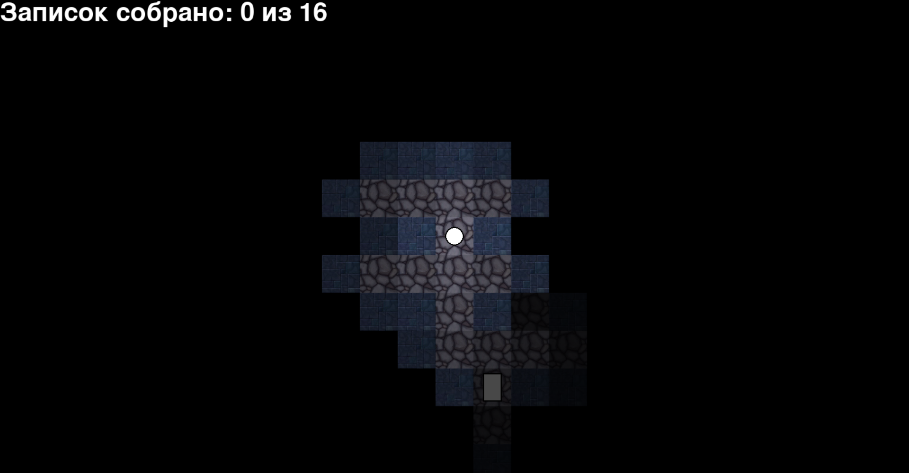

# MazeGame
## Описание
Небольшая хоррор-игра, в которой необходимо собирать записки в лабиринте и убегать от врагов.

В игре есть 3 генератора лабиринтов, которые выбираются случайно при генерации нового уровня.

## Зависимости
Python 3

Pip

Pygame
## Запуск с помощью скрипта
Необходимо запустить скрипт start.sh
## Запуск
Для запуска игры необходимо запустить main.py